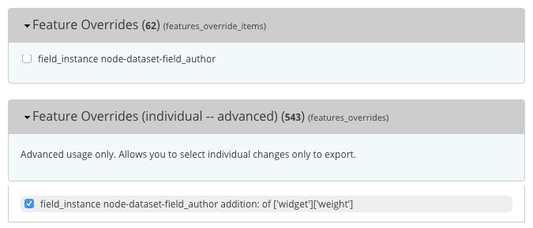

# Overriding custom fields

## Features Override
If you absolutly need to override custom fields, use `features_overrides` **BUT**, override individual items and **NOT** the whole field definition.

This is an example of what overriding a field item weight should look like:



**DON'T USE THE FIRST ONE**. Use the second one. As soon as you start using the first you set the build to a `update-blocking` state.

Items that are **"safe"** to override:

+ Field weights
+ Display weights
+ Max length of a `charfield`
+ Cardinality of a field
+ Other minor field options

## Items that are not a good idea to override:

#### Allowed Values in a `List (Integer|Float|text)`.

This is how a feature_override of a list of allowed values looks like in an info file:

```php
features[features_overrides][] = field_base.field_frequency.settings|allowed_values|0
features[features_overrides][] = field_base.field_frequency.settings|allowed_values|1
features[features_overrides][] = field_base.field_frequency.settings|allowed_values|10
features[features_overrides][] = field_base.field_frequency.settings|allowed_values|11
features[features_overrides][] = field_base.field_frequency.settings|allowed_values|12
```

This is how it looks in the `*.features.features_overrides.inc` file:

```php
/**
 * Implements hook_features_override_default_overrides().
 */
function my_module_features_override_default_overrides() {
  // This code is only used for UI in features. Exported alters hooks do the magic.
  $overrides = array();

  // Exported overrides for: field_base
  $overrides["field_base.field_frequency.settings|allowed_values|0"] = '5th of jan';
  $overrides["field_base.field_frequency.settings|allowed_values|1"] = 'Adhoc';
  $overrides["field_base.field_frequency.settings|allowed_values|10"] = 'Fortnightly';
  $overrides["field_base.field_frequency.settings|allowed_values|11"] = 'Monthly';
  $overrides["field_base.field_frequency.settings|allowed_values|12"] = 'One-Time Load';
  $overrides["field_base.field_frequency.settings|allowed_values|13"] = 'Other';
  $overrides["field_base.field_frequency.settings|allowed_values|14"] = 'Quarterly';
  ....
```

This is how it look in the `*.features.inc` file:

```php
/**
 * Implements hook_field_default_field_bases_alter().
 */
function eic_custom_fields_field_default_field_bases_alter(&$data) {
  if (isset($data['field_frequency'])) {
    $data['field_frequency']['settings']['allowed_values'][0] = '5th of jan'; /* WAS: 'Annually' */
    $data['field_frequency']['settings']['allowed_values'][1] = 'Adhoc'; /* WAS: 'Biennial' */
    $data['field_frequency']['settings']['allowed_values'][10] = 'Fortnightly'; /* WAS: 'Quarterly' */
    $data['field_frequency']['settings']['allowed_values'][11] = 'Monthly'; /* WAS: 'Semiannual' */
    $data['field_frequency']['settings']['allowed_values'][12] = 'One-Time Load'; /* WAS: 'Semimonthly' */
    $data['field_frequency']['settings']['allowed_values'][13] = 'Other'; /* WAS: 'Semiweekly' */
    $data['field_frequency']['settings']['allowed_values'][14] = 'Quarterly'; /* WAS: 'Three times a month' */
    $data['field_frequency']['settings']['allowed_values'][15] = 'Semesterly'; /* WAS: 'Three times a week' */
    $data['field_frequency']['settings']['allowed_values'][16] = 'Semesterly/Ad hoc'; /* WAS: 'Three times a year' */
    $data['field_frequency']['settings']['allowed_values'][17] = 'Weekly'; /* WAS: 'Triennial' */
    ...
```

Each of the values in the list is an individual item to override. It's nuts and something that will potentially drive people mad every time they need to solve a merge conflict. **Don't do it.**

Suscribe the list of values in a `hook_form_alter` implementation. If you need an example, look at how the list of allowed values for `field_license` is implemented. [link here](https://github.com/GetDKAN/dkan/blob/0eb104d1b011b3411ab538ddb4735793d7893b7b/modules/dkan/dkan_dataset/modules/dkan_dataset_content_types/dkan_dataset_content_types.module#L17)

## Future enhacements

DKAN Core fields that utilize an allowed values list should implement the same usecase as `field_license`. This involves:

+ Implementing the `hook_form_alter` approach in a core module
+ Allow to subscribe and unsubscribe values using a hook implementation
